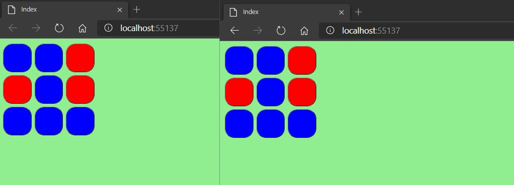

# Tareas del MOC

## Module 12: Performance and Communication

# Lesson 3: Two-Way Communication

### Demonstration: How to Use SignalR

- Instalamos los paquetes de dependencias

- En el middleware registramos la el uso de signalR y definimos la ruita

- Añadimos la carpeta HUB y una clase SquaresHub que heredamos de Hub

  - Añadimos el constructor y la tarea SwapColor

- Modificamos el **Index**  del Square incluimos link al fichero javascript que conecta con el hub

- Modificamos el **javascript** para que se conecte al hub 

- EJecutamos

  

